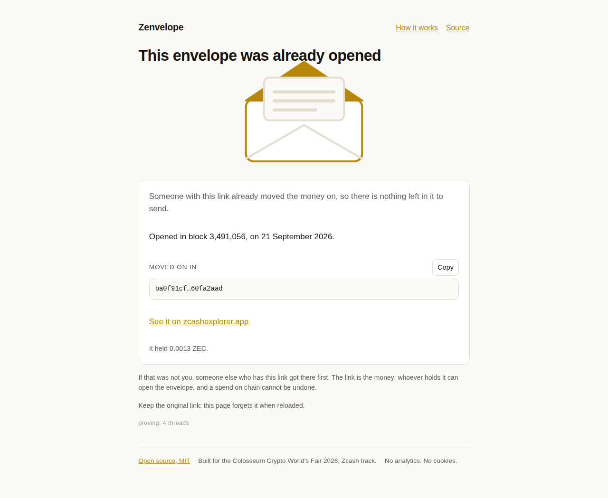

# M2 verification

Evidence that a browser opens a real, funded mainnet envelope: it derives the viewing
key from the link fragment alone, streams compact blocks from a public lightwalletd
gateway over gRPC-web, trial-decrypts the Ironwood note, and shows the amount that the
zcash-devtool oracle independently reports for the same transaction.

Run on 2026-09-21. Everything below is a transcript of commands that were actually
executed, not a description of what they would do.

- Repo: `/root/Projects/web3-sweep/zenvelope`, branch `main`
- Network: **mainnet** throughout. Nothing here spends: the whole milestone is a read.
- Envelope under test: the one funded for M1 (tx `281e9f7b…341d43`, block 3,490,472,
  130,000 zatoshi = 0.0013 ZEC, Ironwood). Its link fragment is the money, so it is not
  in this repo: it lives in the gitignored `M1-FUND.md` and is passed to the test run as
  `ZENV_M1_FRAGMENT`, read at run time and never printed, logged or committed.
- Oracle numbers are the ones recorded in `web/docs/M1-VERIFICATION.md` §5, produced by
  `zcash-devtool` from the browser-derived viewing key.

## 1. The build

```sh
./scripts/build-core.sh
cargo test -p zenvelope-core
node scripts/smoke-core.mjs
cd web && npm ci && npm test && npm run build
```

| | |
| --- | --- |
| wasm, raw | **788,781 bytes** (770 KB) |
| wasm, gzip | 399,942 bytes (390 KB) |
| wasm-pack | 0.13.1, `--target web --release`, `wasm-opt` on |
| `cargo test -p zenvelope-core` | **36 passed**, 0 failed, 1 ignored |
| `node scripts/smoke-core.mjs` | **15 checks passed** |
| `npm test` (vitest) | **78 passed** in 5 files |
| `npm run build` | `tsc -b && vite build`, clean |

The scanner is what grew the wasm: 435,317 bytes at M1 (derivation only) to 788,781
bytes here, the difference being `zcash_client_backend`, the generated
`CompactTxStreamer` client, `tonic-web-wasm-client` and the Orchard/Ironwood note
decryption. Still one HTTP asset, still no prover — that arrives with M3.

`npm run build` emits the wasm as a real asset rather than inlining it:

```
dist/assets/zenvelope_core_bg-DZM6SfMq.wasm  788.78 kB
dist/assets/zenvelope_core-tEcMdrDV.js        19.18 kB │ gzip:  5.67 kB
dist/assets/index-DPpJcWvK.js                195.94 kB │ gzip: 65.53 kB
```

## 2. Interface: the real export against the TypeScript contract

`web/src/core/types.ts` is what the app codes against, and until this milestone it was
written against the mock. Three mismatches with the real `open_envelope` were found and
fixed, all in the type declarations rather than in the wasm:

| | Contract said | The export does | Fix |
| --- | --- | --- | --- |
| Result shape | `found, notes, total_zat, tip_height` | also `birthday`, `birthday_defaulted`, `scanned_blocks` | added the three fields (they are what `to_js` in `crates/core/src/grpc.rs` sets) |
| `on_progress` | required | `Option<Function>`; a scan runs without one | made optional in `types.ts`, `index.ts` and the mock |
| `payment_uri` | third argument `message` | third argument is now the memo | renamed and re-documented (§4) |

Amounts were already right: `amount_zat` and `total_zat` cross as decimal strings and are
parsed with `BigInt`, never an `f64`. `memo` was already `string | null`, and the real
export does hand back JS `null` for an empty or non-text memo. `open_envelope` already
returned a `Promise` on both sides.

**The MOCK badge does not appear when the real wasm is present.** `web/src/core/index.ts`
falls back to the mock only when `import.meta.glob` finds no build, so with
`web/src/wasm/core` in place `core.isMock` is false and no badge is rendered; both e2e
groups assert `mock-badge` has count 0 on every screen of the real run.

## 3. The real open, in a browser, on mainnet

```sh
cd web
ZENV_M1_FRAGMENT='<secret>.<birthday>' npm run e2e
```

`npm run e2e` is `npm run build && playwright test`: the production build served by
`vite preview` with the production COOP/COEP headers, driven in Playwright chromium.

```
Running 9 tests using 1 worker
  ✓  1 e2e/m1.spec.ts › serves the wasm cross-origin isolated (474ms)
  ✓  2 e2e/m1.spec.ts › creates an envelope and re-derives it from the link (2.5s)
  ✓  3 e2e/m1.spec.ts › derives the documented address for the fixed test vector (617ms)
M2 scan: 64 blocks (3490437..3490500) in 2.0 s, 2 progress callbacks, last [64,64]
  ✓  4 e2e/m2-core.spec.ts › finds the Ironwood note the oracle sees (2.4s)
  ✓  5 e2e/m2-core.spec.ts › rejects a malformed secret without touching the network (250ms)
  -  6..8 e2e/m2-open.spec.ts › the MOCK group (skipped: a real wasm build is present)
M2 open page: 65 blocks (3490437..3490501) in 2.4 s
  ✓  9 e2e/m2-open.spec.ts › opens it in the browser and shows the real amount (4.5s)

  3 skipped
  6 passed (13.5s)
```

### Scan cost

| | Blocks | Range | Wall time |
| --- | --- | --- | --- |
| `m2-core.spec.ts`, wasm on a bare isolated page | **64** | 3,490,437 → 3,490,500 | **2.0 s** |
| `m2-open.spec.ts`, the `/e` page end to end | **65** | 3,490,437 → 3,490,501 | **2.4 s** |

The two ranges differ by one block because mainnet moved between the two tests; the
birthday is the link's, the end is the chain tip at that moment. The `/e` figure is the
honest product number: it is measured from the tap on "Open envelope" to the amount being
on screen, and it includes React, the app's own wasm init, `GetLatestBlock`, the whole
`GetBlockRange` stream, and the `GetTransaction` round trip for the one hit.

Gateway: `https://zjs.zec.rocks/mainnet` (D3). The failover host was not needed.

A repeat run twenty minutes later, with the same build, scanned 70 blocks
(3,490,437 → 3,490,506) in 4.5 s on the bare page and 4.7 s through `/e`. The work grows
with the range, but the spread between two identical runs is the public gateway's, not
the scanner's: budget the open flow against "a few seconds for a fresh link", not against
a fixed number.

### What the page asserted

| | Asserted on screen | Oracle (M1-VERIFICATION.md §5) |
| --- | --- | --- |
| Amount | `0.0013 ZEC` | 130,000 zatoshi |
| Pool | `shielded (Ironwood)` | Ironwood |
| Block | `3,490,472` | 3490472 |
| Transaction | `281e9f7b…99341d43` | `281e9f7bffa5bffc8ee1287cc6e245cc59eee302727ea9d93c7f8e5a99341d43` |
| MOCK badge | absent | — |
| Page errors | none | — |
| Drainer copy | the word "claim" appears nowhere in the body | — |

Screenshot of the opened envelope: [m2-open-real.png](m2-open-real.png). The MOCK-core
screenshot from the flow tests is [m2-open.png](m2-open.png).

`m2-core.spec.ts` additionally checks the note field by field against the oracle
(`amount_zat`, `memo`, `height`, `txid`, `pool`), that `scanned_blocks == tip - birthday
+ 1`, that `birthday_defaulted` is false when the link carries a birthday, and that the
progress callback fires and its last report covers the whole range.

## 4. The memo finding, and what changed because of it

**A ZIP-321 `message=` never reaches the chain.** The M1 envelope was funded from a URI
carrying `message=Zenvelope%20M1`, and the note that arrived has no memo at all: the
oracle prints `received 1 notes, 0 memos` and `Memo: Memo::Empty`, and this milestone's
in-browser scan independently decrypts the same note and gets `memo: null`. The `message`
parameter is a label the *sending wallet* keeps for its own transaction history. Nothing
in ZIP-321 says it goes into the note, and Zodl did not put it there.

So the create flow moved the sender's text to the ZIP-321 **`memo=`** parameter, which is
defined as the bytes of the note's memo field:

- `crates/core`: `payment_uri(address, amount_zat, memo)` — the third argument is now the
  memo, encoded as base64url of its UTF-8 bytes with no padding
  (<https://zips.z.cash/zip-0321>), via `zip321::Payment`'s `MemoBytes`. `message` support
  is gone rather than optional: offering a field the recipient can never see is a promise
  the product cannot keep. Over 512 bytes is rejected, not truncated, and the limit is
  counted in bytes (`MAX_MEMO_BYTES`), so one emoji costs four. Two new exports,
  `memo_byte_length` and `max_memo_bytes`, let the UI count the same way the core does.
- Rust proof: `payment_uri_memo_round_trips_through_base64url` builds the URI, checks the
  parameter is base64url with no `+`, `/` or `=`, **base64url-decodes it and asserts the
  bytes are the sender's text** (including a 4-byte emoji), and re-parses the URI with
  `TransactionRequest::from_uri` to confirm ZIP-321 reads it back as the memo of the one
  payment. `payment_uri_memo_limits` covers 512 bytes exactly, 513 bytes, 128 vs 129
  emoji, and that an empty string emits no parameter at all.
- Web: the create form's label is now **"Message to the recipient (encrypted on-chain,
  revealed when opened)"**, with a live UTF-8 **byte** counter (`512` bytes) and an
  inline error past the limit. The mock core encodes the same way, `TEST_VECTORS.md` and
  both READMEs carry the memo vectors, and `m1.spec.ts` asserts the created URI is
  `zcash:<address>?amount=0.0013&memo=aGVsbG8` with no `message=` anywhere.

The new URI shape, for the fixed test vector:

```
zcash:u1nxx35…zpwv4f?amount=0.1&memo=WmVudmVsb3BlIHRlc3QgdmVjdG9y
```

The next envelope funded from this flow will therefore arrive with its memo on-chain and
encrypted, and `/e` will show it under "Their message" — the M1 envelope cannot be fixed
retroactively, which is why the open-page test asserts an amount and not a message.

## 5. Exact commands

```sh
# from the repo root
./scripts/build-core.sh
cargo test -p zenvelope-core
node scripts/smoke-core.mjs

cd web
npm ci
npm test
npm run build

# the real mainnet proof. The fragment is the money: it is read from the private,
# gitignored M1-FUND.md at run time, never echoed, and never committed.
ZENV_M1_FRAGMENT="$(grep -m1 -oP '(?<=/e#)[A-Za-z0-9_.-]+' ../M1-FUND.md)" npm run e2e

# and the MOCK flow group, which is what a checkout with no wasm build runs:
mv src/wasm /tmp/wasm-stash && npm run e2e; mv /tmp/wasm-stash src/wasm
```

Both paths were run for this document: with the wasm present, 6 passed and the 3 MOCK
flow tests skipped; with it absent, the 3 MOCK flow tests passed and the 6 real-core
tests skipped.

## 6. Spent detection

Added 2026-09-24. Until then the scan never looked at nullifiers, so an envelope that had
already been swept still opened to its old amount, took a destination, proved for half a
minute, and only failed at broadcast. The M1 envelope is the case in point: funded with
130,000 zatoshi at block 3,490,472 and swept in
`ba0f91cfe7ca33dd269b692bf80027df2681a321215e90ab28c2a56260fa2aad` at block 3,491,056.

**How it works.** The compact pass rebuilds each note it decrypts (52 bytes of plaintext
are the whole note; `rho` is the action's nullifier field) and derives its nullifier with
the link's Orchard full viewing key, `Note::nullifier(fvk)`, the same call orchard's
builder makes when the sweep spends it. It then compares every `ironwood_actions[]`
nullifier (and `actions[]` for an Orchard note) from the blocks it is already walking,
from the note's block to the tip. Each chunk is decrypted in parallel, its nullifiers are
added to the watch set, then the chunk is checked in parallel for spends; the set carries
over to later chunks. Details in [crates/core/README.md](../../crates/core/README.md),
"Spent detection".

**What the page does.** All notes spent: a distinct screen, "This envelope was already
opened", with the spend's block and date, its txid, an explorer link, what the envelope
held, and no amount and no send-on controls. Some spent: the envelope opens with the
unspent amount only, SendOn is handed only the unspent notes, and a line says how much
was already moved on. Copy lives in `src/copy/en.ts` (`alreadyOpened`), under the same
audit as the rest.

**Tests.**

| | |
| --- | --- |
| Rust | `scan::tests::spent::*` (10): the scan's nullifier equals the one orchard's builder puts in the spending action for a synthetic Ironwood note; a spend in the same chunk and in a later chunk is seen; a nullifier in the wrong pool's list is not; totals count unspent notes only; a note the walk never watched is an error |
| vitest | `openFlow.test.ts`: the reducer's `spent` state, partial spends, the latest-spend and date helpers, and the MOCK's spent variants |
| MOCK e2e | `e2e/spent-mock.spec.ts`: a secret starting `spentAll` opens to the already-opened screen, `spentOne` to 0.0003 ZEC plus the line about the rest (markers documented in `src/core/mock.ts`) |
| real e2e | `e2e/spent-real.spec.ts`, own chromium on port 4261: the M1 envelope shows "already opened", block 3,491,056, txid `ba0f91cf…`; the fee envelope still opens with 0.0003 ZEC and the send-on flow |
| real core | `e2e/m2-core.spec.ts` now asserts the M1 note comes back `spent: true` with the sweep's txid and height, `all_spent: true`, `total_zat: "0"`, `spent_zat: "130000"` |

**Measured**, 2026-09-24, desktop chromium, the threaded package, the fee envelope
(birthday 3,490,472, about 3,800 blocks to the tip at 3,494,2xx), tap to amount, three
opens each on the same build of the page with only the wasm swapped:

| wasm | open 1 | open 2 | open 3 | median |
| --- | --- | --- | --- | --- |
| before (main `dde7368`) | 41.6 s | 46.0 s | 50.3 s | 46.0 s |
| with spent detection | 43.3 s | 40.9 s | 55.0 s | 43.3 s |

The difference is inside the run-to-run spread of the public gateway. That is what the
design predicts: no extra request, the blocks are already in memory, the watch set is
empty until the first note, and after it the check is one hash lookup per action. The M1
envelope reached its already-opened screen in 51.6 s over the same span of chain.

```sh
./scripts/build-core.sh && cd web && npm run build
ZENV_FIXTURE_DIR=/path/to/private/dir ZENVELOPE_E2E_PORT=4261 ZENV_TIMING_RUNS=3 \
  npx playwright test e2e/spent-real.spec.ts
```

`ZENV_FIXTURE_DIR` names the directory holding the private M1-FUND.md and M3-DEST.md; the
fragments are read out of them at run time and never printed (`e2e/fixtures.ts`).
`ZENV_SWEPT_FRAGMENT` and `ZENV_FEE_FRAGMENT` override them. Nothing is broadcast: the
page is loaded with `?dry=1` and neither test reaches a sweep.


